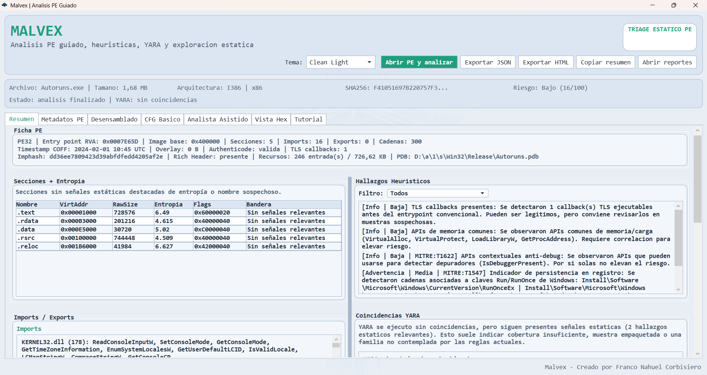
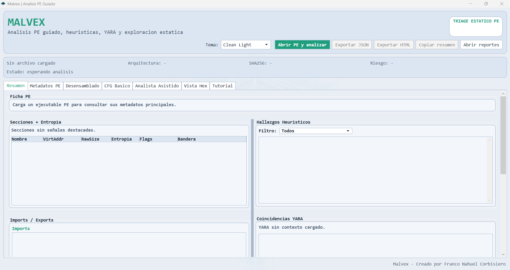
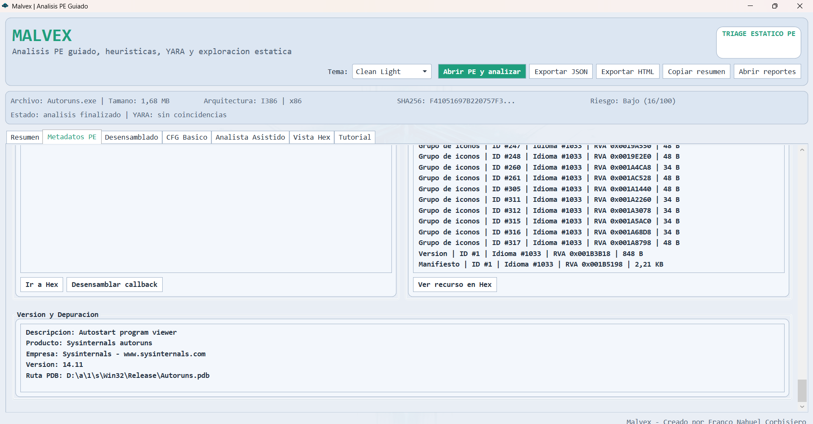
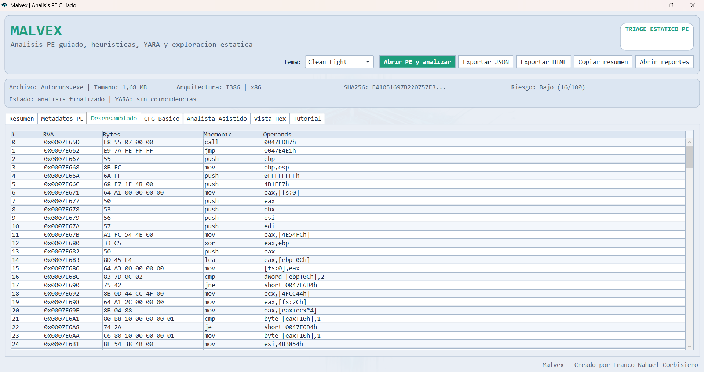
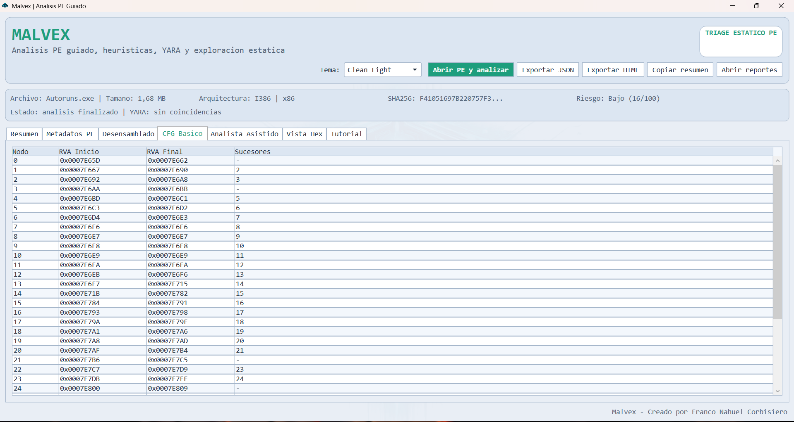
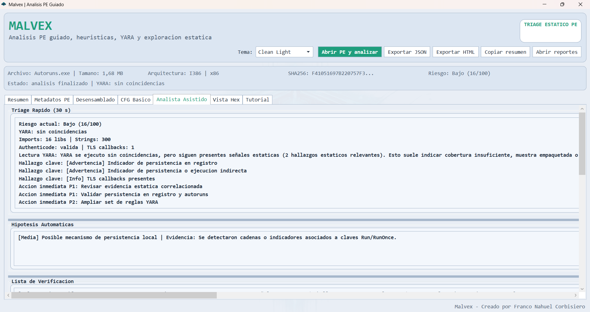
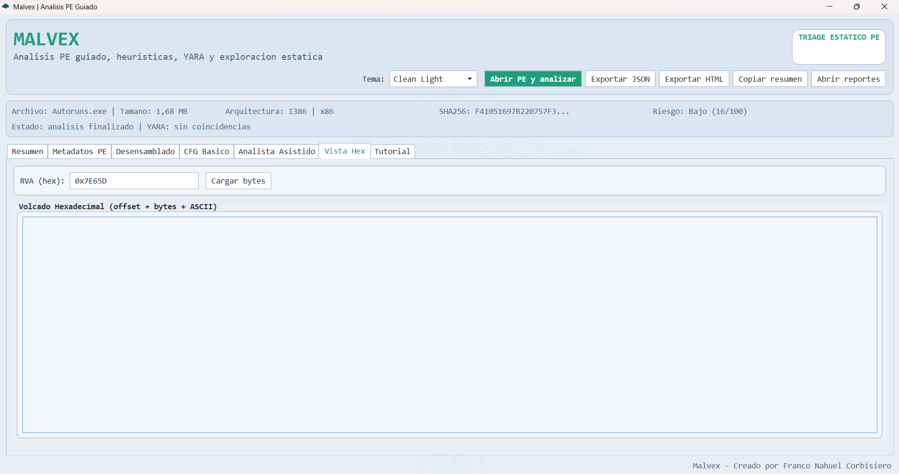
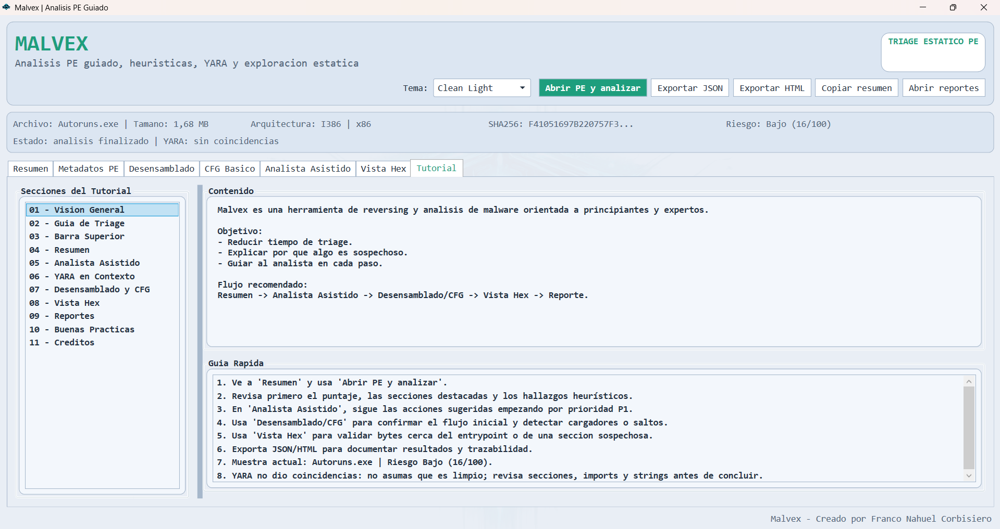

# Malvex

Malvex es una herramienta open source de analisis estatico de archivos PE para
Windows. Esta orientada al triage rapido, la exploracion visual y la asistencia
guiada: transforma metadatos tecnicos dispersos en una primera lectura
estructurada que ayuda a decidir que revisar despues.

Creado y mantenido por **Franco Nahuel Corbisiero**.

Malvex es software libre y gratuito bajo [Apache License 2.0](LICENSE). Consulta
[NOTICE](NOTICE), [SECURITY.md](SECURITY.md), [PRIVACY.md](PRIVACY.md) y
[THIRD_PARTY_NOTICES.md](THIRD_PARTY_NOTICES.md) antes de redistribuir builds.

## Descargar

La version estable actual es [Malvex 1.1.0](https://github.com/corbisierofranconahuel/Malvex/releases/tag/1.1.0).

- `Malvex-Setup-x64.msi`: instalador para Windows x64.
- `Malvex-win-x64-portable.zip`: version portable.
- `SHA256SUMS.txt`: hashes para verificar integridad antes de ejecutar.

## Vista rapida



Malvex concentra la primera etapa del analisis en una interfaz accesible:
identifica propiedades del PE, resalta senales que merecen investigacion y
mantiene visible la diferencia entre una evidencia tecnica y una conclusion.
No intenta reemplazar herramientas especializadas como Ghidra, IDA o x64dbg:
su objetivo es acelerar y documentar el triage estatico inicial.

## Capturas

<details>
<summary>Ver recorrido visual completo</summary>

### Inicio adaptable y temas visuales



### Resumen, secciones, imports, heuristicas y YARA


### Metadatos PE, recursos, TLS, version y PDB



### Desensamblado localizado desde el entrypoint



### CFG basico para inspeccionar el flujo inicial



### Analista Asistido con acciones priorizadas



### Vista Hex navegable por RVA



### Tutorial integrado



</details>

## Alcance de seguridad

- Malvex realiza analisis estatico local.
- No ejecuta las muestras seleccionadas.
- No sube binarios, hashes ni reportes a servicios externos.
- Para malware real, utiliza una VM aislada incluso cuando el analisis sea estatico.

## Stack

- `Malvex.App`: GUI WPF (.NET 8)
- `Malvex.Core`: modelos compartidos
- `Malvex.Analysis`: parser PE, heuristicas, YARA, desensamblado y guia
- `Iced`: motor actual para la vista de ensamblador

## Estado actual

- Parser PE: cabeceras, secciones, imports y exports
- Ficha PE compacta: entry point, image base, timestamp COFF orientativo y overlay
- Metadatos avanzados:
  - Imphash compatible con triage por familias
  - Rich Header con hash orientativo de toolchain
  - Validacion Authenticode local con firmante y emisor
  - Callbacks TLS previos al entrypoint
  - Inventario seguro de recursos PE con tipo, nombre, idioma, RVA y tamano
  - Ruta PDB y metadatos de version disponibles
- Entropia por seccion
- Extraccion priorizada de cadenas ASCII y UTF-16
- Heuristicas base con puntaje de riesgo
- Integracion YARA por CLI (`yara.exe` / `yara64.exe`)
- Reglas base en `rules/base/malvex_base_rules.yar`
- Desensamblado de entry point
- CFG basico
- Vista Hex por RVA
- Pestaña `Metadatos PE` para identidad, firma, TLS navegable, recursos con salto a Hex, version y PDB
- Busqueda inmediata dentro de cadenas extraidas
- Analisis guiado paso a paso
- Capa `Analista Asistido`:
  - Hipotesis automaticas
  - Lista de verificacion dinamica
  - Acciones sugeridas
  - Linea de tiempo guiada
  - Resumen ejecutivo copiable
- Hallazgos con etiquetas tacticas para triage
- UI adaptable:
  - Inicio maximizado
  - Temas visuales
  - Paneles redimensionables con mouse
  - Scroll interno por panel para evitar que cadenas o imports largos deformen la vista
- Creditos integrados en UI y reportes: `Franco Nahuel Corbisiero`

## YARA setup para ejecutar desde codigo fuente

Los paquetes oficiales ya incluyen YARA para funcionar offline. Si ejecutas
Malvex directamente desde el codigo fuente:

1. Descarga `yara64.exe` desde el release oficial de YARA.
2. Copialo en `tools/yara/yara64.exe` o agregalo al `PATH`.
3. Coloca tus reglas `.yar/.yara` dentro de `rules/`.
4. Si YARA no abre en una VM, revisa que tenga instalado el runtime de Visual C++.

## Ejecutar

```powershell
dotnet build .\Malvex.sln
dotnet run --project .\Malvex.App\Malvex.App.csproj
```

## Compilar release

```powershell
dotnet build .\Malvex.sln -c Release
```

## Pruebas automatizadas

```powershell
dotnet test .\Malvex.sln -c Release
```

La suite cubre PE valido, archivos corruptos, desensamblado localizado y una integracion opcional con `git.exe` para Authenticode, TLS y recursos.

## Paquete portable

```powershell
powershell -ExecutionPolicy Bypass -File .\scripts\publish-portable.ps1
```

Salida esperada:

- `dist\Malvex-win-x64-portable\`
- `dist\Malvex-win-x64-portable.zip`

## Instalador MSI

```powershell
powershell -ExecutionPolicy Bypass -File .\scripts\publish-msi.ps1
```

Salida esperada:

- `dist\msi\Malvex-Setup-x64.msi`

## Release completo

Genera portable, MSI y hashes SHA256 listos para adjuntar a GitHub Releases:

```powershell
powershell -ExecutionPolicy Bypass -File .\scripts\publish-release.ps1
```

Salida esperada:

- `dist\release\Malvex-win-x64-portable.zip`
- `dist\release\Malvex-Setup-x64.msi`
- `dist\release\SHA256SUMS.txt`

## Firma digital

Requiere certificado de firma de codigo (`.pfx`) emitido a tu nombre.

```powershell
powershell -ExecutionPolicy Bypass -File .\scripts\sign-release.ps1 -PfxPath "C:\certs\franco_corbisiero.pfx" -PfxPassword "TU_PASSWORD"
```

## Exportar reportes

- Desde la GUI: `Exportar JSON` y `Exportar HTML`.
- Los archivos se guardan en `%LOCALAPPDATA%\Malvex\reports`.

## Checklist previa a publicacion

1. Ejecuta `dotnet build .\Malvex.sln -c Release`.
2. Genera paquete portable o MSI desde `scripts/`.
3. Prueba una muestra PE benigna y una muestra controlada en VM.
4. Verifica YARA en una maquina limpia con VC++ runtime instalado.
5. Confirma que no se suban `dist/`, `bin/`, `obj/` ni reportes.
6. Revisa `docs\PUBLICATION_GUIDE.md`.

## Documentacion del proyecto

- [Tutorial](docs/TUTORIAL.md)
- [Checklist de release](docs/RELEASE_CHECKLIST.md)
- [Guia de publicacion en GitHub](docs/PUBLICATION_GUIDE.md)
- [Guia de contribuciones](CONTRIBUTING.md)

## Roadmap resumido

1. Mejorar CFG por funciones y targets indirectos.
2. Afinar heuristicas para reducir falsos positivos.
3. Incorporar automatizacion guiada mas avanzada para triage.
4. Ampliar cobertura de reglas YARA curadas y casos de prueba.
5. Profundizar recursos PE para previsualizar y extraer payloads embebidos de forma segura.
6. Ampliar fingerprints de toolchain a partir de Rich Header y metadatos de compilacion.
